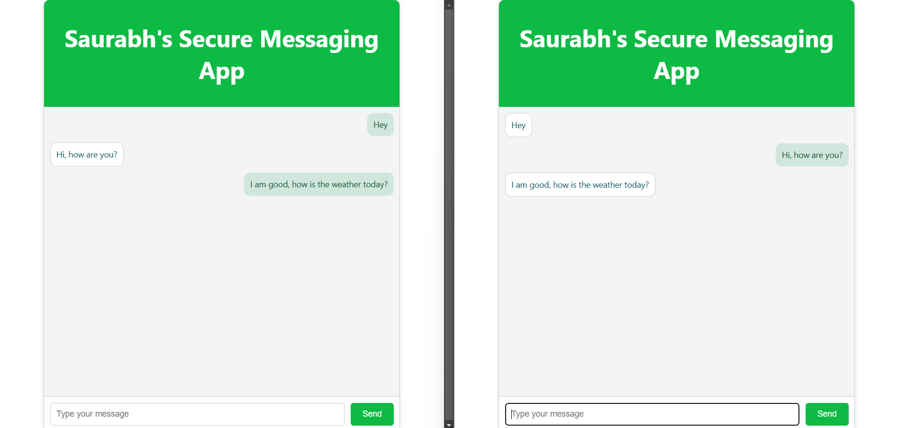
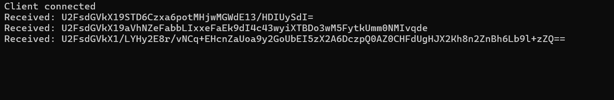

# Secure Chat App

A **Secure Chat App** built with React (TypeScript) and Node.js to demonstrate end-to-end encrypted messaging. This project encrypts messages using AES encryption before sending them over WebSockets and decrypts them upon receipt.

## Features

- End-to-End AES Encryption for messages.  
- Real-time messaging using WebSockets.  
- User-friendly interface for sending and receiving messages.  

## Screenshots

### Secure Chat App Interface

### Encrypted Message in Backend Console

## Prerequisites

Make sure you have the following installed on your system:  
- [Node.js](https://nodejs.org/) (v14+)  
- [npm](https://www.npmjs.com/) (v6+)  
- [TypeScript](https://www.typescriptlang.org/)  

## Installation and Setup

To set up and run the project locally:  
1. Clone the repository using the command:  
   `git clone https://github.com/imsaurabh1/secure_chat_app.git`  
   Navigate to the project directory:  
   `cd secure_chat_app`.  

2. Set up the backend:  
   Navigate to the `backend` directory:  
   `cd backend`  
   Install dependencies:  
   `npm install`  
   Compile the TypeScript code:  
   `npx tsc`  
   Start the backend server:  
   `node dist/server.js`  
   The backend server will run on `ws://localhost:8080`.

3. Set up the frontend:  
   Navigate to the `frontend` directory:  
   `cd ../frontend`  
   Install dependencies:  
   `npm install`  
   Start the React development server:  
   `npm start`  
   The app will be available at `http://localhost:3000`.

## Usage

1. Open the chat app in two different tabs in your browser at `http://localhost:3000` to see real-time communication.

2. Type a message in the input field and press Enter. 

Messages will be encrypted, sent to the server, and displayed after decryption in real time.

## Technologies Used

The frontend uses **React (TypeScript)** for the user interface and **CryptoJS** for encryption, while the backend uses **Node.js** and **WebSocket** for real-time communication.
